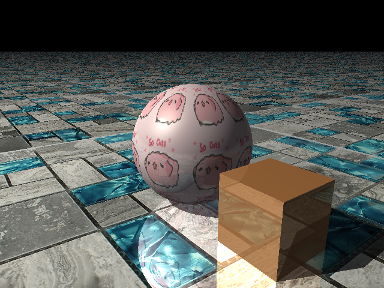
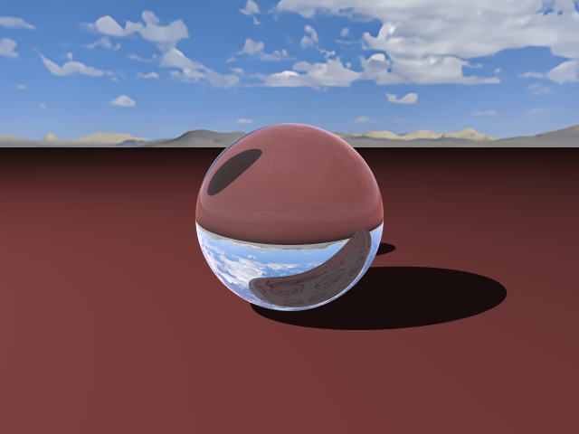
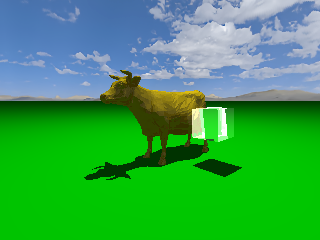
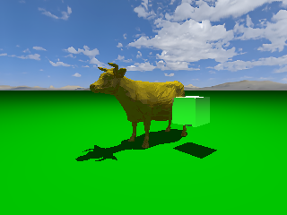
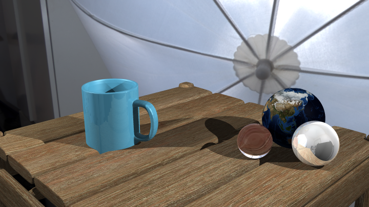

# The Raytracer
## Computer Graphics
### Ricardo Reyes Mercado | 16/12/2020

## Compilación

Se requiere una instalación local de las librerias
* [Armadillo 10.1.2](http://arma.sourceforge.net/download.html)
* [libpng 1.6.37](http://www.libpng.org/pub/png/libpng.html)
* [png++ 0.2.10](http://download.savannah.nongnu.org/releases/pngpp/)

Compilar con `cmake 3.18` sobre el directorio `raytracer_src/`. En caso de que este método no funcione, eliminar el Cache local de cmake y compilar con el `Makefile` incluido (aparentemente cmake tiene problemas para linkear libpng).

## Ejecución
El programa se ejecuta con el comando 
> `./raytracer [scene_path] [image w] [image h] [aadepth]`

Y regresa una imagen `${scene_path}_out.png` con la escena descrita.

Se pueden escribir escenas personalizadas para el raytracer usando el formato `.json`. Las escenas incluidas `TestSpheres.json` y `ShinyCow.json` son buenos ejemplos de la sintaxis que espera el programa.

## Uso
El raytracer soporta el renderizado de de las primitivas **esfera**, **plano** y **triángulo**. Para el renderizado de poligonos y mallas 3D poligonales se utiliza la solo primitiva **triángulo**.

Cada una de las primitivas soporta materiales de tipo **Textura UV**, **Color plano**, **Metálico** y **Dieléctrico (transparente)**. También se puede hacer combinaciones entre estos materiales para generar resultados más interesantes.

Así mismo, se soporta la creación de varias fuentes de luz puntuales, cada una con su respectiva posición, color e intensidad. Así mismo se requiere de un hiperparámetro (puede ser 0 para tener solo iluminación rebotes) para la iluminación global. Este parámetro es util para simular escenas al aire libre.

Se puede manipular la pocición de la cámara y el campo de visión en grados, la dirección se indica mediante un punto. También se requiere de una textura (puede tener cualquier razón aspecto y cualquier resolución) para similuar el cielo.

*(En esta imagen se pueden apreciar todos los tipos de primitiva, todos los tipos de materiales menos el dialectrico y una sola luz con color calido)*

*(Metarial dielectrico con un material de textura opaca siendo refractado. Se tiene una imagen equirectangular para el cielo)*

El modelo de íluminación implementado es el modelo de Whitted el cual es un superconjunto del modelo de Phong. Se tiene soporte para anti-alliasing de distintas profundidades mediantes el multiples muestras por pixel. Si no se especifica un nivel de AA, por default no se harán calculos de AA.

Dentro del directorio `samples/` se enceuntran más ejemplos de imagesnes renderizadas con este programa.

## Detalles de implementación

Para mallas poligonales se implementó el test de esfera englobante para optimizar en tiempo de ejecución. Así mismo, por default el programa corre con todos los nucleos de procesamiento disponibles en la máquina. Aún así, los tiempos de carga para escenas con mayor precencia de mallas poligonales o escenas con varios materiales dielectricos es muy elevado.

## Objetivos no logrados 

Saliendo un poco del infinitivo, no logré implementar el raytracer jerarquico debido a que no supe como recuperar la distancia de intersección de un rayo con un objeto con respecto al marco de referencia de mundo y la intersección geometrica al mismo tiempo. 

Tecnicamente solo para el modelo de phong (sin reflecciones ni nada elegante) funcionaría bien, ya que las normales y la distancia de intersección eran correctamente calculadas, sin embargo las reflecciones y refracciones representan un problema ya que la intersección con respecto al marco de objeto y la intersección con respecto al marco del mundo no parecian concidir respecto a la orientación o dirección de la cual venía el rayo, terminando con resultados como este

donde se puede apreciar que el cubo parece estár mostrando los reflejos que están del lado opuesto a la cara que se presenta y además parecen estar rotados 90°

Lo más lejos que llegué respecto a la derivación de la fuente de este error fue que, la manera en la que logro hacer coinsidir la distancia con respecto al marco del objeto con la distancia con respecto al marco del mundo, fue solo tomando la parte lineal de la transformación afín al momento de trasnformar la dirección del rayo. Sin embargo no se me ocurre como recuperar la distancia global sin hacer este hack (que evidentemente no sirve).

Esta es la imagen correcta. Utilizando trasnformaciones precalculadas al momento de importar el objeto.

## Resultados finales

Como mencioné anteriormente, vienen incluidas las escenas de ShinyCow y TestSpheres. ShinyCow tarda aproximadamente 3 hora en renderizarse con antialiasing 5 a 640x480. TestSpheres se renderiza a la misma resolución en tan solo 5 minutos.

Incluí una última escene default. niceScene. Esta es por mucho las que mas tarda en cargar, ya que con un nivel de antialiasing 4, tardó 32 horas en cargar haciendo uso de 16 hilos (2 hilos mas que los usados para ShinyCow y TestSpheres).

*(imagen generada por niceScene.json)*

## Fuentes
* [table.obj](https://www.turbosquid.com/3d-models/3d-simja-table-design-1654080)
* [woodTexture.png](https://www.turbosquid.com/3d-models/3d-simja-table-design-1654080)
* [mug.obj](https://www.turbosquid.com/3d-models/coffee-mug-1-3d-model-1362850)
* [studio.png](https://hdrmaps.com/photo-studio/)
* [clearSkies.png](https://www.turbosquid.com/FullPreview/Index.cfm/ID/1261148)
* [soCuteMika.png](https://stickers.cloud/pack/bugcat-capoo-1)
* [mosaicTexture.png](https://www.mosafil.nl/glass-mosaic-natural-stone-tiles-sinop-grey-blue-2-mix.html?action_ms=1)
* [earth.png](https://b3d.interplanety.org/en/mapping-texture-to-planet/)
* [diamond.obj](https://www.turbosquid.com/3d-models/free-perfect-model/675252)

## Referencias

[Raytracer from scratch in C++.](https://www.youtube.com/watch?v=k_aRiYSXcyo&list=PLHm_I0tE5kKPPWXkTTtOn8fkcwEGZNETh) *No recomiendo nada este tutorial*

[I created my own Ray Tracing Engine from scratch.](https://www.youtube.com/watch?v=lKIytgt3KXM&t=365s)

[An improved illumination model for shaded display.](https://dl.acm.org/doi/10.1145/358876.358882)

[Raytracer in a weekend.](https://raytracing.github.io/books/RayTracingInOneWeekend.html)

[introduction to Ray Tracing: a Simple Method for Creating 3D Images.](https://www.scratchapixel.com/lessons/3d-basic-rendering/introduction-to-ray-tracing)

